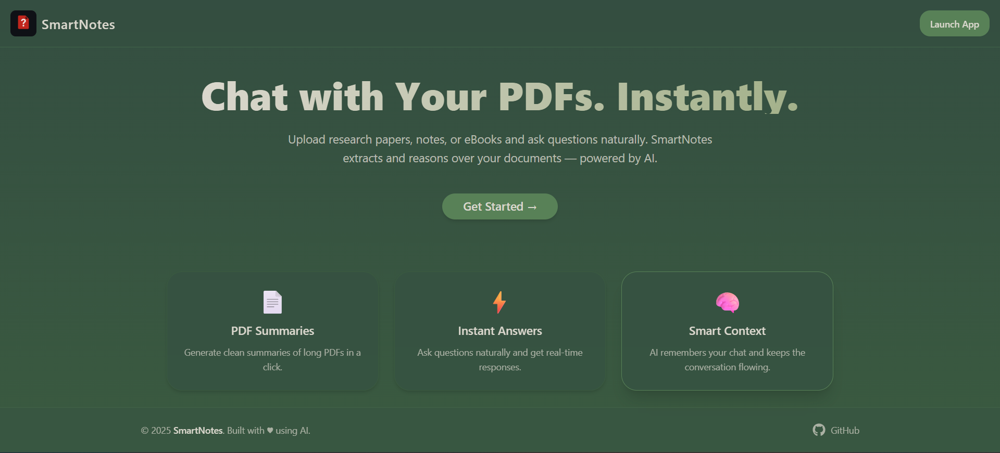
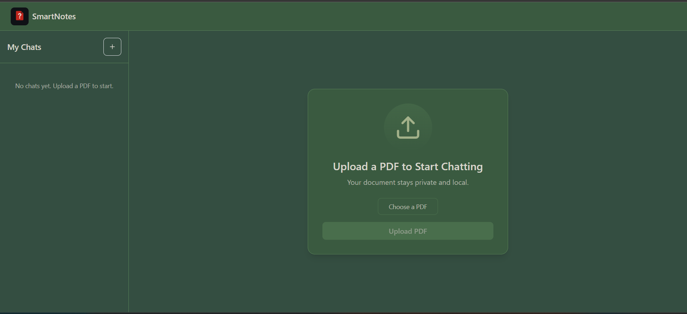
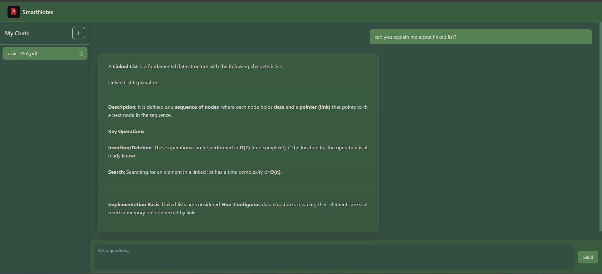

# 🧠 SmartNotes – Your Intelligent PDF & Notes Assistant

SmartNotes is an AI-powered note-taking and document analysis web app.  
Upload an **PDF**, and SmartNotes will extract, embed, and let you **chat with your notes**.  
It saves all your documents and conversations, so you can revisit them anytime — just like your personal study or research assistant.

---

## 🚀 Features

  **AI-Powered PDF Understanding**  
* Upload research papers, textbooks, or notes — ask any question, get accurate answers.

**Persistent Conversations**
* All your chats are stored in MongoDB, so you can pick up where you left off.

**Multi-Document Support**  
* Each PDF has its own dedicated chat thread and embeddings in Qdrant for fast retrieval.

**Real-Time Upload Feedback**  
* See exactly what’s happening — from “Extracting text” to “Generating embeddings” — in an interactive upload progress view.

**Seamless UI/UX**  
* Modern, minimal React + Tailwind interface with smooth animations and Markdown-styled AI responses.

**Efficient Storage Management**  
* Deleting a chat removes its file, embeddings, and conversation history — keeping your space optimized.

---

## 🧩 Tech Stack

| Layer | Technology |
|-------|-------------|
| **Frontend** | React + Vite + TailwindCSS + Shadcn UI + Framer Motion |
| **Backend** | FastAPI (Python) |
| **Database** | MongoDB Atlas (for conversations) |
| **Vector DB** | Qdrant (for embeddings) |
| **AI Embeddings** | SentenceTransformers |
| **LLM Integration** | Google Gemini API |
| **Other Tools** | PyMuPDF (PDF parsing), LangChain (optional), Pydantic, Axios |

---

##   Backend Setup

* `cd backend`
* `python -m venv venv`
* `source venv/bin/activate  # or venv\Scripts\activate (Windows)`
* `pip install -r requirements.txt`

### Environment Variables

Create a `.env` file in `backend/` with:

  `QDRANT_URL=http://localhost:6333.cloud.qdrant.io`  
  `QDRANT_API_KEY=jejhbfuefb-dkw-wecehcb.wehubuc-edwejhb`  
  `MONGO_URI=mongodb+srv://<your_user>:<your_pass>@cluster.mongodb.net/smartnotes`  
  `GEMINI_API_KEY=your_google_gemini_api_key`

Run command: `uvicorn app.main:app --reload`

---

##   Frontend Setup

* `cd ../frontend`
* `npm install`
* `npm run dev`

---

##   Preview of Website

### Landing Page:

---
### Upload Section:

---
### Chat Window:

---

